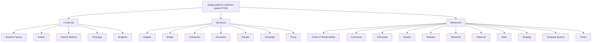

<div align="center">


[](https://github.com/fabricioguidine/design-patterns-with-java/actions/workflows/ci.yml) [](LICENSE) [](https://openjdk.org) [](https://maven.apache.org)

</div>

> Hands-on implementations of the 23 Gang of Four design patterns in Java, for study.

A multi-module Maven project where every classic GoF design pattern lives in its own module under one of the three canonical categories: Creational, Structural, and Behavioral. Each module ships a small, self-contained example and JUnit 5 tests.

## Table of Contents

- [Patterns implemented](#patterns-implemented)
  - [Creational](#creational)
  - [Structural](#structural)
  - [Behavioral](#behavioral)
- [Architecture](#architecture)
- [Requirements](#requirements)
- [Build and run](#build-and-run)
- [Project structure](#project-structure)
- [License](#license)

## Patterns implemented

All 23 GoF patterns are present, grouped by category. Each module uses the base package `org.example`.

### Creational

| Pattern | Module | Intent |
|---|---|---|
| Abstract Factory | `creational/abstractFactory` | Create families of related objects without naming concrete classes |
| Builder | `creational/builder` | Construct a complex object step by step |
| Factory Method | `creational/factoryMethod` | Defer instantiation to a factory that returns a common interface |
| Prototype | `creational/prototype` | Create new objects by cloning an existing instance |
| Singleton | `creational/singleton` | Ensure a class has a single, globally accessible instance |

### Structural

| Pattern | Module | Intent |
|---|---|---|
| Adapter | `structural/adapter` | Make an incompatible interface usable through a wrapper |
| Bridge | `structural/bridge` | Decouple an abstraction from its implementation |
| Composite | `structural/composite` | Treat individual objects and compositions uniformly |
| Decorator | `structural/decorator` | Add responsibilities to an object dynamically |
| Facade | `structural/facade` | Expose a simplified interface over a subsystem |
| Flyweight | `structural/flyweight` | Share fine-grained objects to reduce memory use |
| Proxy | `structural/proxy` | Provide a surrogate that controls access to an object |

### Behavioral

| Pattern | Module | Intent |
|---|---|---|
| Chain of Responsibility | `behavioral/chainOfResponsibility` | Pass a request along a chain of handlers |
| Command | `behavioral/command` | Encapsulate a request as an object |
| Interpreter | `behavioral/interpreter` | Evaluate sentences of a small language |
| Iterator | `behavioral/iterator` | Traverse a collection without exposing its structure |
| Mediator | `behavioral/mediator` | Centralize communication between objects |
| Memento | `behavioral/memento` | Capture and restore an object's state |
| Observer | `behavioral/observer` | Notify dependents when a subject changes |
| State | `behavioral/state` | Alter behavior when internal state changes |
| Strategy | `behavioral/strategy` | Make a family of algorithms interchangeable |
| Template Method | `behavioral/templateMethod` | Define an algorithm skeleton, defer steps to subclasses |
| Visitor | `behavioral/visitor` | Add operations to a type hierarchy without changing it |

## Architecture



The root `pom.xml` is a `pom`-packaged aggregator that declares all 23 modules and centralizes dependency and plugin management (JUnit 5, AssertJ, JaCoCo, Spotless, Checkstyle, SpotBugs).

## Requirements

- JDK 17 or higher (CI builds against 17 and 21)
- Apache Maven 3.6+

Verify your toolchain:

```powershell
java -version
mvn -version
```

## Build and run

All commands run from the repository root and apply across every module.

Build and test the whole project:

```powershell
mvn -B verify
```

Compile and install all modules without running tests:

```powershell
mvn -B clean install -DskipTests
```

Run the full test suite:

```powershell
mvn -B test
```

Build a single pattern (example: Singleton):

```powershell
mvn -B -pl design-patterns/creational/singleton -am verify
```

Run the quality profile (Spotless, Checkstyle, SpotBugs):

```powershell
mvn -B verify -Pquality
```

## Project structure

```text
design-patterns-with-java/
├── pom.xml                       # Parent aggregator POM (23 modules)
├── config/                       # Checkstyle, SpotBugs config
├── design-patterns/
│   ├── creational/               # abstractFactory, builder, factoryMethod, prototype, singleton
│   ├── structural/               # adapter, bridge, composite, decorator, facade, flyweight, proxy
│   └── behavioral/               # chainOfResponsibility, command, interpreter, iterator,
│                                 # mediator, memento, observer, state, strategy,
│                                 # templateMethod, visitor
├── .github/workflows/ci.yml      # Build, test, and quality CI
└── LICENSE
```

Each module follows the standard Maven layout:

```text
<pattern>/
├── pom.xml
└── src/
    ├── main/java/org/example/    # Pattern implementation
    └── test/java/                # JUnit 5 tests
```

## License

Released under the [MIT License](LICENSE).
